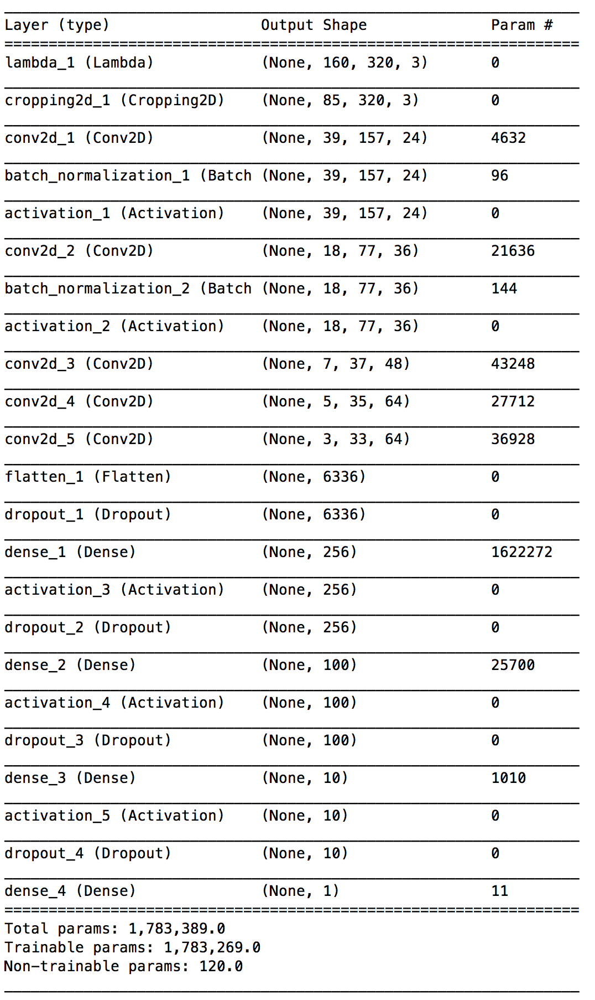
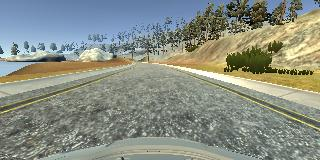
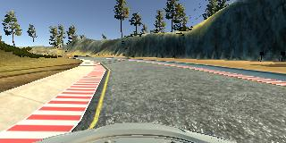
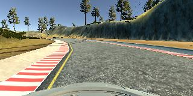
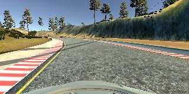
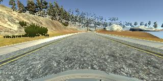

#**Behavioral Cloning**
---

**Behavioral Cloning Project**

The goals / steps of this project are the following:

* Use the simulator to collect data of good driving behavior
* Build, a convolution neural network in Keras that predicts steering angles from images
* Train and validate the model with a training and validation set
* Test that the model successfully drives around track one without leaving the road
* Summarize the results with a written report


[//]: # (Image References)

[image1]: ./examples/placeholder.png "Model Visualization"
[image2]: ./examples/placeholder.png "Grayscaling"
[image3]: ./examples/placeholder_small.png "Recovery Image"
[image4]: ./examples/placeholder_small.png "Recovery Image"
[image5]: ./examples/placeholder_small.png "Recovery Image"
[image6]: ./examples/placeholder_small.png "Normal Image"
[image7]: ./examples/placeholder_small.png "Flipped Image"

## Rubric Points
###Here I will consider the [rubric points](https://review.udacity.com/#!/rubrics/432/view) individually and describe how I addressed each point in my implementation.

---
###Files Submitted & Code Quality

####1. Submission includes all required files and can be used to run the simulator in autonomous mode

My project includes the following files:
 
* model.py containing the script to create and train the model
* drive.py for driving the car in autonomous mode
* model.h5 containing a trained convolution neural network
* writeup.pdf summarizing the results
* video.mp4 provide a demo of autonmous driving.

####2. Submission includes functional code
Using the Udacity provided simulator and my drive.py file, the car can be driven autonomously around the track by executing
```sh
python drive.py model.h5
```

####3. Submission code is usable and readable

The model.py file contains the code for training and saving the convolution neural network. The file shows the pipeline I used for training and validating the model, and it contains comments to explain how the code works.

###Model Architecture and Training Strategy

####1. An appropriate model architecture has been employed


My model is based on [NVIDIA‘s deep learning self-driving car model](https://devblogs.nvidia.com/parallelforall/deep-learning-self-driving-cars/), with few modification to met the input we get from the simulator(320x160):

* instead of (5x5) in the first layer, increase to 8x8

* increase the hidden size of first and second FC layer to 256 and 100.

####2. Attempts to reduce overfitting in the model

* Add batch normalization layer between the first 2 convolution layers and it's activation layers.
* Add dropout layer with drop rate 0.4 between each FC layer.

The model was trained and validated on different data sets to ensure that the model was not overfitting (code line 48). The model was tested by running it through the simulator and ensuring that the vehicle could stay on the track.

####3. Model parameter tuning

The model used an adam optimizer, so the learning rate was not tuned manually (model.py line 131).

####4. Appropriate training data

Training data was chosen to keep the vehicle driving on the road. I used a combination of:

* center lane driving,
* recovering from the left and right sides of the road.
* driving in track 2.

For details about how I created the training data, see the next section.

###Architecture and Training Documentation

####1. Solution Design Approach

The overall strategy for deriving a model architecture was to having a model which give input as a image captured from a camera installed behind the wind shield and predict the angle of steering wheel. So this is a aggression problem, similiar to image classification problem, CNN should be able to provide pretty good result.

My first step was to use a convolution neural network model similar to the NVIDIA's self-driving deep learning model, I thought this model might be appropriate because it's yielding good result in NVIDIA's real self-driving car.

In order to gauge how well the model was working, I split my image and steering angle data into a training and validation set. I found that my first model had a low mean squared error on the training set but a high mean squared error on the validation set. This implied that the model was overfitting.

To combat the overfitting, I modified the model so that there are dropout layers in between each full connection layer.

Then I add a batch normalization layer after the first two convolution layers to get faster training speed.

The final step was to run the simulator to see how well the car was driving around track one. There were a few spots where the vehicle fell off the track, for example the sharp turns and the turns with no ledges on the side. To improve the driving behavior in these cases, I collect more data on these spot and have the model retrained on these place.

At the end of the process, the vehicle is able to drive autonomously around the track without leaving the road.

####2. Final Model Architecture

By having batch size 64, the final model architecture (model.py lines 97-128) consisted of a convolution neural network with the following layers and layer sizes:

| Layer                 |     Description    | 
|:---------------------:|:---------------------------------------------:| 
| Input                 | 64x80x320x3 RGB image   | 
| Convolution 8x8       | 2x2 stride, same padding, outputs 64x40x160x24 |
| Batch Normalization | |
| RELU                  | |
| Convolution 5x5       | 2x2 stride, same padding, outputs 64x20x80x36 |
| Batch Normalization | |
| RELU                  | |
| Convolution 5x5       | 2x2 stride, same padding, outputs 64x10x40x48 |
| RELU                  | |
| Convolution 3x3       | 1x1 stride, same padding, outputs 64x10x40x64 |
| RELU                  | |
| Convolution 3x3       | 1x1 stride, same padding, outputs 64x10x40x64 |
| RELU                  | |
| Dropout               | 0.6 keep prob|
| Fully connected       | hidden size 256, output 64x256  |
| RELU                  | |
| Dropout               | 0.6 keep prob|
| Fully connected       | hidden size 100, output 64x100  |
| RELU                  | |
| Dropout               | 0.6 keep prob|
| Fully connected       | hidden size 10, output 64x10  |
| RELU                  | |
| Dropout               | 0.5 keep probabilty|
| Fully connected       | output 64x1  |
| RELU                  | |

Here is a visualization of the architecture



####3. Creation of the Training Set & Training Process

To capture good driving behavior, I first recorded two laps on track one using center lane driving. Here is an example image of center lane driving:



I then recorded the vehicle recovering from the left side and right sides of the road back to center so that the vehicle would learn to steering hard when the turning is realy big. These images show what a recovery looks like starting from the left side :





Then I recorded more data in the vehicle turing in the sharp turns, vehicle on the bridge which get different texture from the normal road.

Then I repeated this process on track two in order to get more data points.

For track two, it's much more difficult for it's getting a lot of sharp turns, and shadows of the mountain and trees, cliffs, two parallel road next to each other (which confused the model and it will lead to the other road). Also when uphill or downhill, the view of the road is changed with the pitch angle changed. So when collecting the data of track two, I drive slow and result for more data point.

To augment the dataset, I also flipped images and angles thinking that this would help to increase the number of train data, also helps to fight against the bias of track 1 that most of the turning is to the left, flip will balence the ratio to the left and right. For example, here is an image that has then been flipped:




PS. This aproach is only valid when the data record from simulator is drive stick to the middle. For example if the data is collect with stick to right side of lanes like in real world:

|Car Position | Streering Direction | Flipped Position | Filpped Steering Direction|
|:------------:|:-----------------:|:------------------:|:-------------------------:|
Right lane|neutual|Left Lane|neutual
Left Lane | right| Right Lane| left

It's shows the filpped data is conflict with the origin, so that it'll yield bad performace.

After the collection process, I had X number of data points. 
I then preprocessed this data by:

* cropping - the input image has size 320*160, with area 60px on the top and 20px in the bottom is irrelevent, and have it cropped, which gives smaller image size at 320x80.
* normalization -  ```(image - 128) / 128``` so that the image sent into CNN will be zero mean and -1 to 1.  


I finally randomly shuffled the data set and put 10% of the data into a validation set.

I used this training data for training the model. The validation set helped determine if the model was over or under fitting. The ideal number of epochs was 3 as evidenced by the decrease of validation score from the 4th epoch. I used an adam optimizer so that manually training the learning rate wasn't necessary.


####4. Provide a link to the video
Here's a [link to my video result](./output_images/project_video.mp4)
